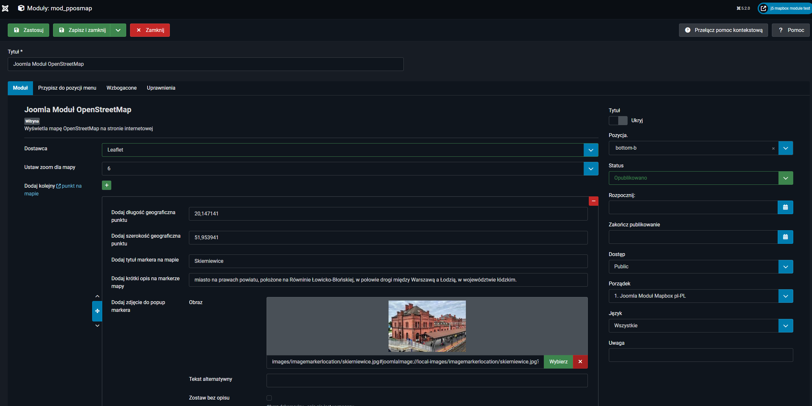

mod_pposmap – mapa (Mapbox / Leaflet) dla Joomla
===============================================

Moduł site dla Joomla, który wyświetla mapę z punktami (markery) oraz opcjonalną listę punktów.

Autor: pablop76 (web-service.com.pl)

## Dostawca mapy

Moduł obsługuje dwa tryby:

- **Mapbox** (Mapbox GL JS): https://www.mapbox.com/
- **Leaflet** (OpenStreetMap + Leaflet): https://leafletjs.com/

## Instalacja

1. Zainstaluj moduł w Joomla (Extensions → Manage → Install).
2. Opublikuj moduł w wybranej pozycji szablonu.
3. Skonfiguruj parametry modułu.

## Konfiguracja

### Podstawowe

- **Dostawca**: Mapbox / Leaflet.
- **Token Mapbox**: wymagany w trybie Mapbox.
- **Style Mapbox**: opcjonalnie (np. `mapbox://styles/mapbox/streets-v12`).
- **Kontrola grup na mapie** (Leaflet): pozwala grupować markery po polu „Nazwa grupy”.
- **Punkty na mapie**: dodawane w subform (lat/lng, tytuł, opis, godziny, telefon, obrazek, opcjonalnie grupa).

### Ustawienia mapy

- **Zoom**: domyślny zoom mapy.
- **Wysokość mapy**: opcjonalnie. Przykłady: `600px`, `70vh`, `100%`.
	- Gdy puste, moduł używa bezpiecznej wysokości domyślnej z CSS.
- **Wysokość mapy (mobile)**: opcjonalnie. Działa tylko na ekranach ≤ 800px.
	- Gdy puste, używana jest wartość z „Wysokość mapy” (lub bezpieczne minimum).
- **Dodaj własny marker**: opcjonalna ikona markera.
- **Dodaj listę punktów jako opis mapy**: lista punktów jest **widoczna tylko na desktop** (na mobile jest ukryta).

## Zrzuty ekranu

### Widok ustawień (backend)

### Widok na stronie (frontend)

