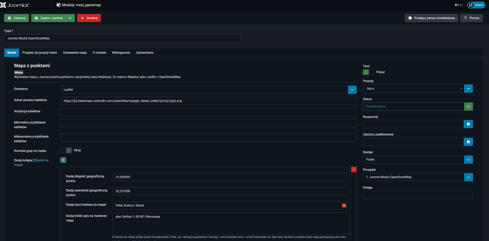
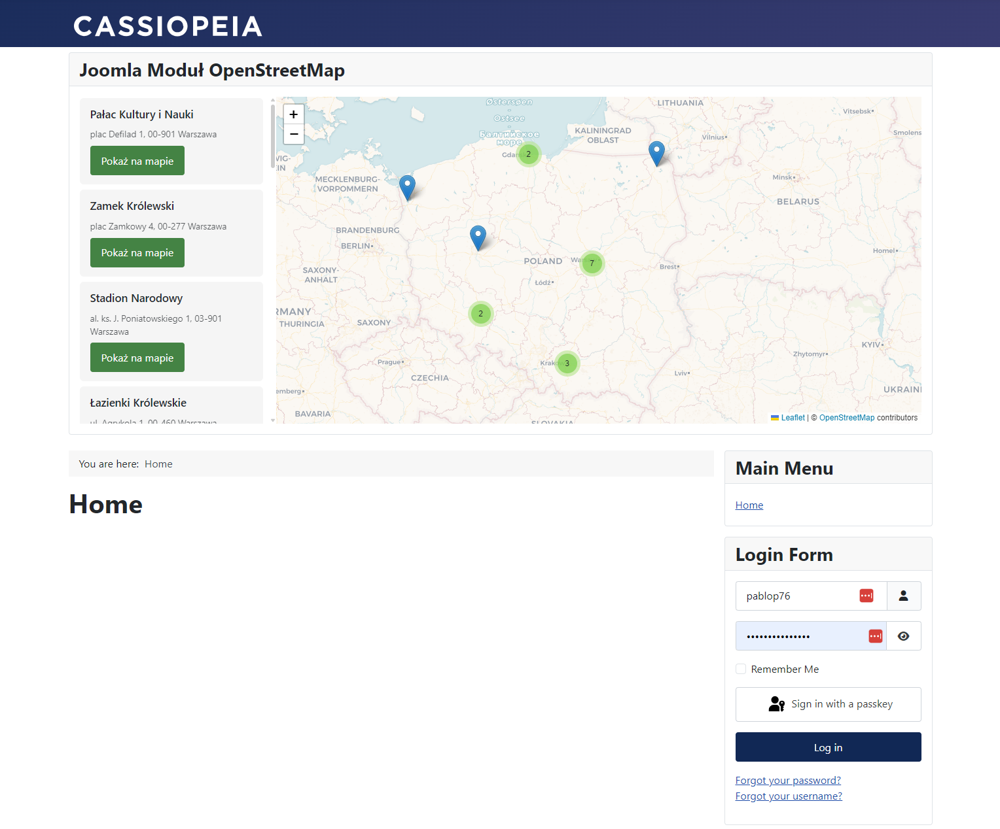

mod_pposmap – mapa (Mapbox / Leaflet) dla Joomla
===============================================

Moduł site dla Joomla, który wyświetla mapę z punktami (markery) oraz opcjonalną listę punktów.

Autor: pablop76 (web-service.com.pl)

## Dostawca mapy

Moduł obsługuje dwa tryby:

- **Mapbox** (Mapbox GL JS): https://www.mapbox.com/
- **Leaflet** (OpenStreetMap + Leaflet): https://leafletjs.com/

## Instalacja

1. Zainstaluj moduł w Joomla (Extensions → Manage → Install).
2. Opublikuj moduł w wybranej pozycji szablonu.
3. Skonfiguruj parametry modułu.

## Konfiguracja

### Podstawowe

- **Dostawca**: Mapbox / Leaflet.
- **Token Mapbox**: wymagany w trybie Mapbox.
- **Style Mapbox**: opcjonalnie (np. `mapbox://styles/mapbox/streets-v12`).
- **Kontrola grup na mapie** (Leaflet): pozwala grupować markery po polu „Nazwa grupy”.
- **Punkty na mapie**: dodawane w subform (lat/lng, tytuł, opis, godziny, telefon, obrazek, opcjonalnie grupa).

### Serwer kafelków (tylko tryb Leaflet)

- **Adres serwera kafelków**: szablon adresu z polami `{z}/{x}/{y}`, np. `https://tile.thunderforest.com/cycle/{z}/{x}/{y}.png?apikey=KLUCZ`.
	Klucz API dopisuje się jako zwykły parametr adresu. Działa też ścieżka względna do kafelków hostowanych u siebie (`/tiles/{z}/{x}/{y}.png`).
	Gdy puste, moduł używa kafelków OpenStreetMap.
- **Atrybucja kafelków**: napis o prawach autorskich w rogu mapy, dozwolone odnośniki HTML.
	Gdy puste, pokazywana jest atrybucja OpenStreetMap.

	> Po podmianie serwera kafelków **trzeba** ustawić własną atrybucję. Domyślna przestaje być prawdziwa,
	> a atrybucja jest warunkiem licencji u większości dostawców. Moduł wypisuje ostrzeżenie w konsoli przeglądarki,
	> gdy ustawiono własny adres kafelków bez atrybucji.

- **Minimalne / maksymalne przybliżenie kafelków**: limity dostawcy. Powyżej maksimum mapa pokazuje szare pola
	zamiast kafelków. OpenStreetMap obsługuje 19. Gdy puste, obowiązują domyślne ustawienia Leafletu.

#### Gotowe adresy kafelków

Podgląd wszystkich stylów: [leaflet-providers](https://leaflet-extras.github.io/leaflet-providers/preview/).
Poniżej zestawy do wklejenia wprost w pola modułu. Żaden nie wymaga klucza API.

| Styl | Adres | Maks. zoom |
|---|---|---|
| OpenStreetMap (domyślny) | `https://tile.openstreetmap.org/{z}/{x}/{y}.png` | 19 |
| CartoDB Positron (jasny, stonowany) | `https://{s}.basemaps.cartocdn.com/light_all/{z}/{x}/{y}{r}.png` | 20 |
| CartoDB Dark Matter (ciemny) | `https://{s}.basemaps.cartocdn.com/dark_all/{z}/{x}/{y}{r}.png` | 20 |
| CartoDB Voyager (jasny, z etykietami) | `https://{s}.basemaps.cartocdn.com/rastertiles/voyager/{z}/{x}/{y}{r}.png` | 20 |
| OpenTopoMap (topograficzny) | `https://{s}.tile.opentopomap.org/{z}/{x}/{y}.png` | 17 |
| CyclOSM (rowerowy) | `https://{s}.tile-cyclosm.openstreetmap.fr/cyclosm/{z}/{x}/{y}.png` | 20 |
| Esri World Imagery (zdjęcia satelitarne) | `https://server.arcgisonline.com/ArcGIS/rest/services/World_Imagery/MapServer/tile/{z}/{y}/{x}` | 19 |

Pola `{s}` (subdomena) i `{r}` (wariant dla ekranów retina) są wbudowane w Leaflet i nie wymagają konfiguracji.
Zwróć uwagę, że Esri ma w adresie kolejność `{z}/{y}/{x}`, a nie `{z}/{x}/{y}`.

Odpowiadające atrybucje do wklejenia w pole **Atrybucja kafelków**:

```html
<!-- OpenStreetMap -->
&copy; <a href="https://www.openstreetmap.org/copyright">OpenStreetMap</a> contributors

<!-- CartoDB (Positron, Dark Matter, Voyager) -->
&copy; <a href="https://www.openstreetmap.org/copyright">OpenStreetMap</a> contributors &copy; <a href="https://carto.com/attributions">CARTO</a>

<!-- OpenTopoMap -->
Map data: &copy; <a href="https://www.openstreetmap.org/copyright">OpenStreetMap</a> contributors, <a href="http://viewfinderpanoramas.org">SRTM</a> | Map style: &copy; <a href="https://opentopomap.org">OpenTopoMap</a> (<a href="https://creativecommons.org/licenses/by-sa/3.0/">CC-BY-SA</a>)

<!-- CyclOSM -->
<a href="https://github.com/cyclosm/cyclosm-cartocss-style/releases">CyclOSM</a> | Map data: &copy; <a href="https://www.openstreetmap.org/copyright">OpenStreetMap</a> contributors

<!-- Esri World Imagery -->
Tiles &copy; Esri, Source: Esri, i-cubed, USDA, USGS, AEX, GeoEye, Getmapping, Aerogrid, IGN, IGP, UPR-EGP, and the GIS User Community
```

> Serwery OpenStreetMap, OpenStreetMap France (CyclOSM) i OpenTopoMap są utrzymywane społecznościowo i mają
> limity ruchu. Do wdrożeń produkcyjnych z realnym obciążeniem wybierz dostawcę z planem i kluczem API
> (np. MapTiler, Thunderforest, Stadia Maps) albo hostuj kafelki u siebie.

### Ustawienia mapy

- **Zoom**: domyślny zoom mapy.
- **Wysokość mapy**: opcjonalnie. Przykłady: `600px`, `70vh`, `100%`.
	- Gdy puste, moduł używa bezpiecznej wysokości domyślnej z CSS.
- **Wysokość mapy (mobile)**: opcjonalnie. Działa tylko na ekranach ≤ 800px.
	- Gdy puste, używana jest wartość z „Wysokość mapy” (lub bezpieczne minimum).
- **Dodaj własny marker**: opcjonalna ikona markera.
- **Dodaj listę punktów jako opis mapy**: lista punktów jest **widoczna tylko na desktop** (na mobile jest ukryta).

## Zrzuty ekranu

### Widok ustawień (backend)



### Widok na stronie (frontend)




